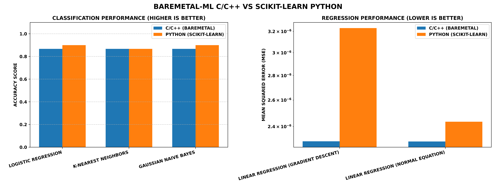

# BAREMETAL-ML: MODELS FROM SCRATCH

<p align="center">
  
  
  
  
  
  <br><br>

<h1 align="center">PURE C/C++. PURE MATHEMATICS. NO BLACK BOXES.</h1>

> <p align="center"><b>MASTERING MACHINE LEARNING FUNDAMENTALS BY BUILDING THE ENTIRE PIPELINE FROM THE OS LEVEL UP.</b></p>
> <p align="center"><b>BUILD IT. UNDERSTAND IT. VERIFY IT.</b></p>

<div style="text-align: justify;">
A COMPREHENSIVE IMPLEMENTATION OF CORE MACHINE LEARNING ALGORITHMS BUILT ENTIRELY FROM SCRATCH IN C AND C++. THIS PROJECT ELIMINATES THE ABSTRACTION OF HIGH-LEVEL LIBRARIES TO REVEAL THE RAW MEMORY MANAGEMENT, LINEAR ALGEBRA, AND PROBABILITY THEORY DRIVING MODERN AI. IT FEATURES CUSTOM MATRIX ENGINES, MEMORY-SAFE DATA LOADERS, AND STATEFUL FEATURE SCALERS, ALL BENCHMARKED AGAINST SCIKIT-LEARN FOR MATHEMATICAL FIDELITY.
</div>

---

## 📖 TABLE OF CONTENTS

- [BAREMETAL-ML: MODELS FROM SCRATCH](#baremetal-ml-models-from-scratch)
  - [📖 TABLE OF CONTENTS](#-table-of-contents)
  - [📘 PROJECT OVERVIEW](#-project-overview)
  - [💬 FEATURES](#-features)
  - [📁 ARCHITECTURE BREAKDOWN](#-architecture-breakdown)
  - [🧠 MATHEMATICAL CONCEPTS IMPLEMENTED](#-mathematical-concepts-implemented)
    - [1. LINEAR REGRESSION (C++)](#1-linear-regression-c)
    - [2. LOGISTIC REGRESSION (C)](#2-logistic-regression-c)
    - [3. K-NEAREST NEIGHBORS (C)](#3-k-nearest-neighbors-c)
    - [4. GAUSSIAN NAIVE BAYES (C)](#4-gaussian-naive-bayes-c)
  - [📊 INFRASTRUCTURE BUILT FROM SCRATCH](#-infrastructure-built-from-scratch)
  - [⚙️ HOW IT WORKS](#️-how-it-works)
  - [📈 RESULTS AND VALIDATION](#-results-and-validation)
  - [🚀 FUTURE WORK](#-future-work)
  - [📄 LICENSE](#-license)
  - [📦 INSTALLATION INSTRUCTIONS](#-installation-instructions)

---

## 📘 PROJECT OVERVIEW

THIS REPOSITORY SERVES AS A BARE-METAL DEEP DIVE INTO STATISTICAL MODELING. INSTEAD OF CALLING `model.fit()`, THIS PROJECT MANUALLY IMPLEMENTS O(N^3) MATRIX INVERSIONS, EUCLIDEAN DISTANCE SORTS, AND LOG-LIKELIHOOD MAXIMIZATION USING POINTERS AND HEAP ALLOCATION. IT IS DESIGNED TO PROVE THAT THE MATHEMATICS UNDERPINNING MACHINE LEARNING CAN BE TRANSLATED DIRECTLY INTO HIGH-PERFORMANCE LOW-LEVEL CODE.

---

## 💬 FEATURES

- **ZERO ML LIBRARIES:** THE C/C++ ENGINE RELIES STRICTLY ON STANDARD LIBRARIES (`<stdio.h>`, `<stdlib.h>`, `<vector>`, `<cmath>`).
- **CUSTOM MATH MODULE:** OBJECT-ORIENTED C++ MATRIX AND VECTOR CLASSES FOR DOT PRODUCTS, TRANSPOSE, AND GAUSS-JORDAN ELIMINATION.
- **SCIKIT-LEARN PARITY:** C-BASED `fit`, `transform`, AND `predict` PARADIGMS THAT MIRROR MODERN API ARCHITECTURES.
- **DUAL-LANGUAGE STRATEGY:** C++ UTILIZED FOR MATRIX-HEAVY OPTIMIZATION (LINEAR REGRESSION); C UTILIZED FOR ALGORITHMIC AND PROBABILISTIC CLASSIFIERS.
- **AUTOMATED BENCHMARKING:** INCLUDES A PYTHON VALIDATION SUITE TO VERIFY C/C++ ACCURACY TO THE SIXTH DECIMAL PLACE.

---

## 📁 ARCHITECTURE BREAKDOWN

```text
BAREMETAL-ML/
│
├── Main.cpp                                # THE C/C++ ORCHESTRATOR
├── Validation.py                           # SCIKIT-LEARN VALIDATION SCRIPT
├── CompareMetrics.py                       # AUTOMATED METRICS DIFF & VISUALIZATION
│
├── DATA/                                   # RAW CSV DATASETS
│
├── MATH/                                   # CUSTOM LINEAR ALGEBRA ENGINE (C++)
│   ├── matrix.cpp / matrix.h
│   └── vector.cpp / vector.h
│
├── MODELS/                                 # THE MACHINE LEARNING ALGORITHMS
│   ├── LINEAR REGRESSION/                  (C++)
│   ├── LOGISTIC REGRESSION/                (C)
│   ├── K-NEAREST NEIGHBOR/                 (C)
│   └── NAIVE BAYES/                        (C)
│
├── UTILS/                                  # C-BASED PIPELINE INFRASTRUCTURE
│   ├── data_loader.c / data_loader.h       (CSV PARSING & MEMORY ALLOCATION)
│   ├── data_split.c / data_split.h         (FISHER-YATES TRAIN/TEST SPLIT)
│   ├── normalization.c / normalization.h   (Z-SCORE & MIN-MAX SCALING)
│   └── metrics.c / metrics.h               (MSE, RMSE, R2, ACCURACY, CONFUSION MATRIX)
│
└── RESULT/                                 # AUTOMATED OUTPUT LOGS & BENCHMARKS
```
---

## 🧠 MATHEMATICAL CONCEPTS IMPLEMENTED

### 1. LINEAR REGRESSION (C++)
- **GRADIENT DESCENT:**
  $$\theta_j := \theta_j - \alpha \frac{1}{m} \sum_{i=1}^{m} (h_\theta(x^{(i)}) - y^{(i)}) x_j^{(i)}$$
- **NORMAL EQUATION:**
  $$\theta = (X^T X)^{-1} X^T y$$

### 2. LOGISTIC REGRESSION (C)
- **SIGMOID ACTIVATION:**
  $$\sigma(z) = \frac{1}{1 + e^{-z}}$$
- **LOG LOSS MINIMIZATION:**
  $$J(\theta) = -\frac{1}{m} \sum [y \log(\hat{y}) + (1-y) \log(1-\hat{y})]$$

### 3. K-NEAREST NEIGHBORS (C)
- **EUCLIDEAN DISTANCE:**
  $$d(p, q) = \sqrt{\sum_{i=1}^{n} (q_i - p_i)^2}$$
- **MAJORITY VOTE CLASSIFICATION.**

### 4. GAUSSIAN NAIVE BAYES (C)
- **BAYES THEOREM & LOG-LIKELIHOOD:**
  $$\log P(x_i|y) = -\frac{1}{2} \log(2\pi\sigma_{y,i}^2) - \frac{(x_i - \mu_{y,i})^2}{2\sigma_{y,i}^2}$$

---

## 📊 INFRASTRUCTURE BUILT FROM SCRATCH

- **DYNAMIC CSV LOADER:** TWO-PASS FILE READING ALGORITHM TO DYNAMICALLY ALLOCATE 2D ARRAYS IN MEMORY.
- **FISHER-YATES SHUFFLE:** RANDOMIZED 70/30 TRAIN/TEST SPLITTING TO PREVENT OVERFITTING.
- **MULTI-SCALING ARCHITECTURE:**
  - `StandardScaler` (Z-Score) FOR GRADIENT DESCENT AND NAIVE BAYES.
  - `MinMaxScaler` (0 to 1) FOR DISTANCE-BASED KNN.
- **EVALUATION METRICS:** FULLY IMPLEMENTED ACCURACY, MSE, RMSE, R², AND CONFUSION MATRICES.

---

## ⚙️ HOW IT WORKS

1. **EXECUTION:** `Main.cpp` ACTS AS THE ENTRY POINT, ROUTING DATA THROUGH UTILITY PIPELINES.
2. **PREPROCESSING:** DATA IS LOADED INTO CUSTOM `Dataset` STRUCTS, SHUFFLED, SPLIT, AND NORMALIZED ACCORDING TO THE SPECIFIC NEEDS OF THE DOWNSTREAM MODEL.
3. **TRAINING:** MODELS ALLOCATE MEMORY FOR PARAMETERS AND EXECUTE THEIR RESPECTIVE OPTIMIZATION OR MEMORIZATION ROUTINES.
4. **LOGGING:** RESULTS ARE EXPORTED TO `.txt` CONSOLE LOGS AND APPENDED TO A SHARED `RESULT/C_CPP_IMPLEMENTATION_RESULTS.csv` FILE.

---

## 📈 RESULTS AND VALIDATION

<p align="center">
  
</p>

<div style="text-align: justify;">
THE C/C++ ENGINE ACHIEVED EXACT PARITY IN REGRESSION AND EXPECTED STATISTICAL ALIGNMENT IN CLASSIFICATION, VALIDATING THE UNDERLYING MATHEMATICS.
</div>

- **LINEAR REGRESSION:** BOTH GD AND NORMAL EQUATION MSE MATCHED SCIKIT-LEARN DOWN TO THE SIXTH DECIMAL.
- **K-NEAREST NEIGHBORS:** EXACT PREDICTIVE MATCH (86.6%) PROVING FLAWLESS EUCLIDEAN DISTANCE AND MIN-MAX SCALING.
- **LOGISTIC REGRESSION & NAIVE BAYES:** ACHIEVED 86.6% ACCURACY VS SCIKIT-LEARN'S 90.0%. 

**NOTE:** THE 3.3% CLASSIFICATION VARIANCE IS A KNOWN ARTIFACT OF PRNG SEEDING DIFFERENCES (LCG VS MERSENNE TWISTER) AND OPTIMIZER ARCHITECTURES (VANILLA GD VS L-BFGS). 

👉 **[READ THE FULL MATHEMATICAL DEFENSE AND PERFORMANCE ANALYSIS HERE](RESULT/ANALYSIS.md)**

---

## 🚀 FUTURE WORK

- IMPLEMENT **L1 (LASSO) AND L2 (RIDGE) REGULARIZATION**.
- ADD SUPPORT FOR **MULTI-CLASS CLASSIFICATION** (ONE-VS-REST).
- BUILD A CUSTOM **DECISION TREE** AND **RANDOM FOREST** ENGINE USING RECURSIVE BINARY SPLITTING IN C.

---

## 📄 LICENSE

THIS PROJECT IS LICENSED UNDER THE [MIT LICENSE](LICENSE).

YOU ARE FREE TO USE, MODIFY, AND DISTRIBUTE THIS PROJECT WITH ATTRIBUTION.

---

## 📦 INSTALLATION INSTRUCTIONS

> 1. **CLONE THE REPOSITORY**

---

- `git clone https://github.com/DaRkSouL36/BAREMETAL-ML`

- `cd "BAREMETAL-ML"`

---

> 2. **COMPILE AND RUN THE C/C++ ENGINE**

---

- **REQUIREMENT**: GCC/G++ COMPILER (WITH C++17 SUPPORT).

- **COMPILE:**
  
   `g++ -std=c++17 main.cpp MATH\matrix.cpp MATH\vector.cpp UTILS\data_loader.c UTILS\normalization.c UTILS\data_split.c UTILS\metrics.c "MODELS\LINEAR REGRESSION\linear_regression.cpp" "MODELS\LOGISTIC REGRESSION\logistic_regression.c" "MODELS\K-NEAREST NEIGHBOR\knn.c" "MODELS\NAIVE BAYES\naive_bayes.c" -o Main.exe`

- **EXECUTE:**
  
   `Main.exe`

- **NOTE:** 
   
   OUTPUT WILL BE ROUTED DIRECTLY TO `RESULT/C_CPP_FULL_LOG.txt` & `C_CPP_IMPLEMENTATION_RESULTS.csv`

---

> 3. **RUN THE PYTHON VALIDATION SUITE**

---

- **REQUIREMENT**: PYTHON 3.x AND VIRTUAL ENVIRONMENT.

- **SETUP ENVIRONMENT:**
  
   `python -m venv VENV`

   `VENV\Scripts\activate`   
   
   `pip install pandas numpy scikit-learn`

- **EXECUTE:**
  
   `python Validation.py`

- **NOTE:** 
   
   OUTPUT WILL BE ROUTED DIRECTLY TO `RESULT/PYTHON_FULL_LOG.txt` & `PYTHON_SKLEARN_RESULTS.csv`

---

> 4. **RUN THE AUTOMATED BENCHMARK COMPARISON**

---

- **REQUIREMENT**: MATPLOTLIB MUST BE INSTALLED IN YOUR VIRTUAL ENVIRONMENT.
  
   `pip install matplotlib`

- **EXECUTE:**
  
   `python compare_metrics.py`

- **NOTE:** THIS WILL PRINT A CONSOLE DIFF REPORT AND GENERATE `RESULT/MODEL_COMPARISON_CHART.png`.

<p>
<a href="#baremetal-ml-models-from-scratch">

<strong>RETURN</strong>
</a>
</p>